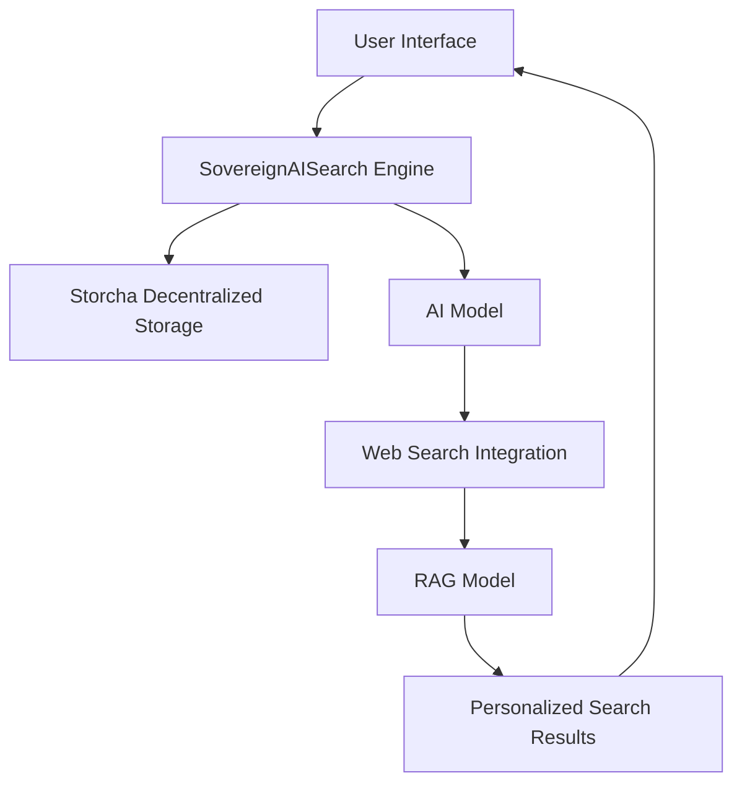
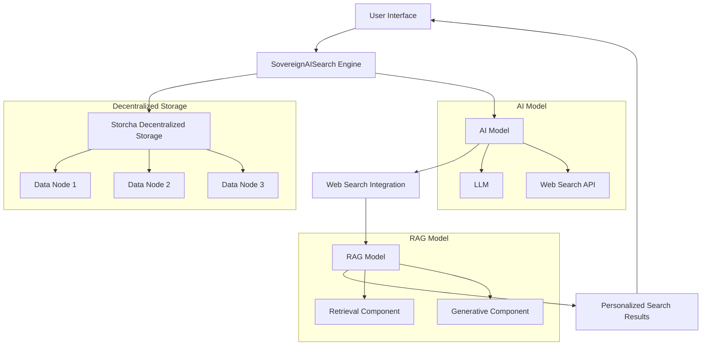

# SovereignAISearch: Decentralized AI Search Engine

**SovereignAISearch** is a cutting-edge, decentralized AI search engine built on Web3 principles, emphasizing user data sovereignty, privacy, and security while leveraging advanced AI for a personalized search experience.

## Key Features

### Decentralized Storage
- **User Data Sovereignty**: Users retain full control over their search data, distributed across a decentralized network using the Storcha platform.

### Advanced AI Capabilities
- **Personalized Search**: SovereignAISearch utilizes AI to analyze user behavior and preferences, offering highly personalized search results. The AI engine learns from user interactions to refine and tailor search outcomes, ensuring that users receive the most relevant information.

### Security and Transparency
- **Transparency**: Users can trace their data history on the Storcha platform.

### Future Prospects
- **Data Sharing Economy**: Users can monetize their data securely.
- **Cross-Chain Integration**: Aims to enable cross-chain search capabilities.

## Technical Implementation

### Architecture Diagram

### Decentralized Storage with Storcha
- Leverages Storcha for secure, distributed data management of user search queries and results.

### AI Model and Web Search Integration for RAG
- Integrates AI models with web search for Retrieval-Augmented Generation (RAG), combining retrieval-based and generative models.

## How it's Made

SovereignAISearch combines Storcha's decentralized storage and AI-driven RAG models for a secure, transparent, and personalized search experience. The system architecture is designed to ensure data sovereignty, privacy, and efficiency.

### Key Components:

#### Storcha Platform
- **Decentralized Storage Capabilities**: The Storcha platform ensures that user data is stored across a decentralized network, giving users full control over their information. This decentralized approach enhances security and privacy by eliminating single points of failure.

#### LLM RAG Model
- **Intelligent Search**: The LLM RAG model combines large language models (LLM) with web search results to provide intelligent and context-aware search outcomes. This model leverages both retrieval-based and generative techniques to deliver highly relevant and personalized search results.

### Detailed Architecture

### Workflow Description

1. **User Interface**: The user interacts with the SovereignAISearch interface, inputting their search query.
2. **SovereignAISearch Engine**: The engine processes the query, directing it to both the Storcha decentralized storage and the AI model.
3. **Storcha Decentralized Storage**: The query is checked against the decentralized storage nodes to retrieve any relevant historical data.
4. **AI Model**: The AI model, consisting of an LLM and web search integration, processes the query to generate potential search results.
5. **Web Search Integration**: The web search API fetches the latest and most relevant web content based on the query.
6. **RAG Model**: The Retrieval-Augmented Generation (RAG) model combines the results from the retrieval component (historical data and web content) with the generative component (LLM) to produce personalized search results.
7. **Personalized Search Results**: The final personalized search results are returned to the user interface for display.

## Conclusion
SovereignAISearch represents a paradigm shift in search technology, prioritizing user data sovereignty and privacy through Storcha while delivering a personalized, AI-driven search experience. This next-generation search engine empowers users with control over their information and offers an efficient, secure search solution.
